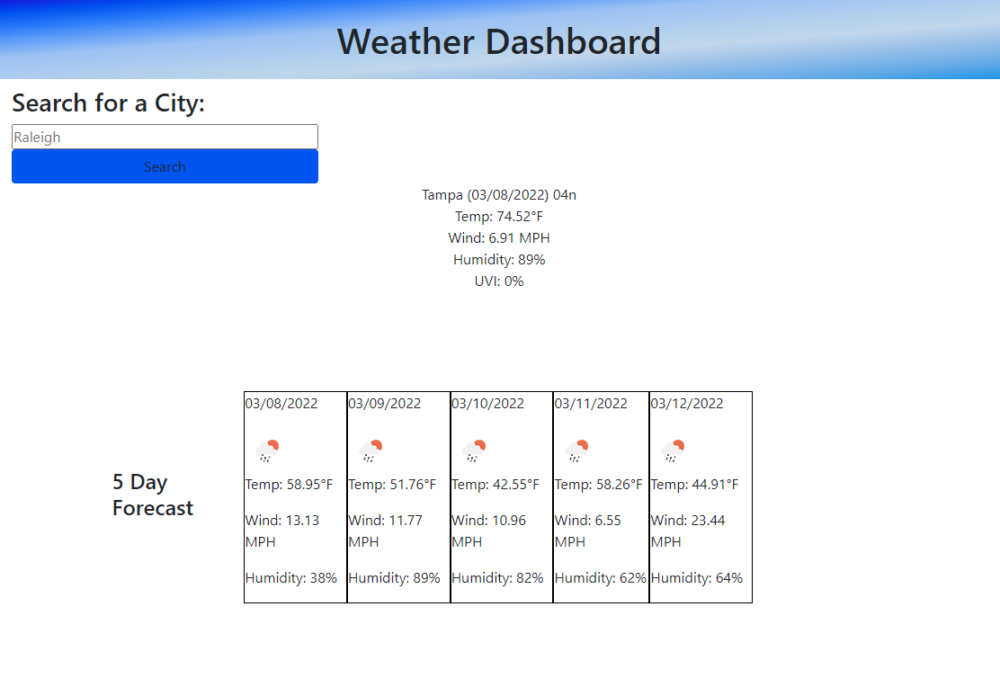

# weather-dashboard-api

[link to live website](https://ro-galvan.github.io/weather-dashboard-api/)

[link to GitHub repository](https://github.com/Ro-Galvan/weather-dashboard-api)


# Description
The user is able to type any city in the US to get weather information for the current day as well as a 5 day forecast. 


## API Reference

#### Get all items

```http
  GET /api/items
```

| Parameter | Type     | Description                |
| :-------- | :------- | :------------------------- |
| `api_key` | `string` | **Required**. Your API key |

#### Get item

```http
  GET /api/items/${id}
```

| Parameter | Type     | Description                       |
| :-------- | :------- | :-------------------------------- |
| `id`      | `string` | **Required**. Id of item to fetch |

#### add(num1, num2)

Takes two numbers and returns the sum.


# Visual

